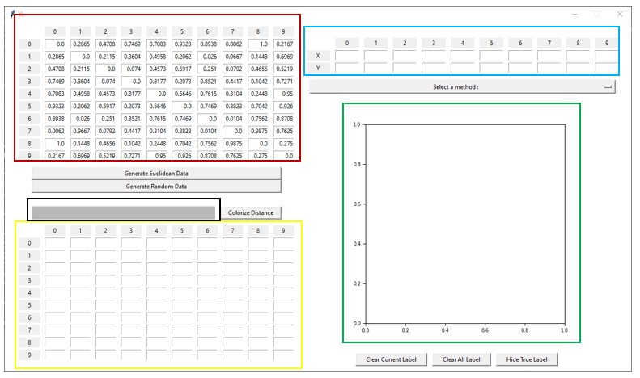
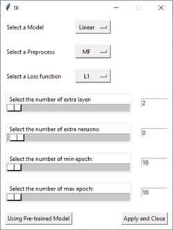

# FYP

This FYP aims to provide a deep learning based solution for recalculate the coordinate from a precalculated distance matrix. In general, it can handle the problem of visualing, multidimensional data, for applications like clustering. 

There are basically two solution, Classical Multidimensional Scaling (CMDS) using mathematical rule and Non-Metric Multidimensional Scaling (NMDS) as an iterative method. However, CMDS is slow and the accuracy is limited to linear transformed data, for non-linear transformed data, CMDS result can still be good but not the best. 

To deal with the issue, extended methods like Landmark Multidimensional Scaling (LMDS) and Isomap are then proprosed. 

## Requirements

- Python 3.7.7
- Library
  - Pytorch 1.0.1 - Framework for implementing neural network
  - Scikit Learn 0.22.1 - Support for implemented algorithm
  - Pandas 0.23.4 - Support for record filtering and exporting 
  - Numpy 1.18.1 - Support for numerical operationas
  - Dill 0.3.1.1 - Support for model backup
  - matplotlab 3.2.1 - Support for visualization of the result
  - tkinter 8.6.8 - Support for GUI

## Solution

### Design 

#### Model Design

- Linear 
- Autoencoder (AE)

With number of nerons, layers and activation function, non-linear transformation can be learnt and hence solve the problem in non-linear way. In the training processes, overfitting happened frequently, which gave the thought to train on a single distance matrix for an overfitting (accurate) result. 

The overfitting result can be more accurate than CMDS. 

### GUI Design

A simple GUI is implemented, using Tkinter, for visualizing and comparing the result of different methods. On the left side, there are two panels for showing the real distance matrix (marked in red) and the reconstructed distance matrix (marked in yellow) using the result from the algorithm (marked in blue). The result coordinate is then plot to the canvas (marked in green). The loss value will also be shown on above the reconstructed distance matrix (marked in black). 

To use the deep learning method, press 'Deep MDS' under 'Select A Method':

### Preprocessing

- Distance Matrix (M)
- Distance Only (D)
- Flatten Distance Matrix (MF)
- Eigenvalues & Eigenvectors (E2)

### Loss Function

- Mean-square error (MSE)
- Square of Relative Loss (SRL)
- Sammon Loss (SML)

### Training Parameters

| Variable            | Value        |
| ------------------- | ------------ |
| Epoch               | Up to 5000   |
| Batch Size          | 16           |
| Training data Size  | 3200         |
| Testing data Size   | 500          |
| Optimizer           | Adam         |
| Learning Rate       | 1e-3 to 1e-8 |
| Activation Function | Leaky ReLU   |

## Result

### Classical Method 

| Method | Loss | Time (Total) |
| - | - | - |
| Classical MDS  | 0.161200 | 83.88296 | 
| Landmark MDS   | 0.233842 | 0.678254 | 
| Isomap         | 0.219480 | 1.813687 | 
| Fastmap        | 0.254199 | 0.770609 | 
| Non-Metric MDS | 0.277422 | 12.92512 | 

### Deep Learning based

| Method | Loss | Time (Total) |
| - | - | - |
| Linear (D) (MSE)  | 0.210721 | 0.688159
| Linear (MF) (MSE) | 0.216925 | 0.558502
| Linear (M) (MSE)  | 0.205467 | 1.214498
| Linear (E2) (MSE) | 0.173446 | 0.770609
| AE (D) (MSE)      | 0.210485 | 0.848468
| AE (MF) (MSE)     | 0.212746 | 0.754941

## Reference

- Arce, C., & Gärling, T. (1989). Multidimensional scaling. Anuario de psicología/The UB Journal of Psychology, (43), 63-80.
- De Silva, V., & Tenenbaum, J. B. (2004). Sparse multidimensional scaling using landmark points (Vol. 120). Technical report, Stanford University.
- Fan, J., Han, F., & Liu, H. (2014). Challenges of big data analysis. National science review, 1(2), 293-314.
- Groenen, P. J., & Borg, I. (2014). Past, present, and future of multidimensional scaling. Visualization and verbalization of data, 95-117
- Lu, L., Shin, Y., Su, Y., & Karniadakis, G. E. (2019). Dying relu and initialization: Theory and numerical examples. arXiv preprint arXiv:1903.06733.
- Holland, S. M. (2008). Non-metric multidimensional scaling (MDS). Department of Geology, University of Georgia, Athens, Tech. Rep. GA, 30602-2501.
- Jung, Kwanghee & Takane, Yoshio. (2015). Multidimensional Scaling I. 10.1016/B978-0-08-097086-8.42045-3.
- Krishnaiah, P. R., & Kanal, L. N. (1982). Theory of multidimensional scaling. In Handbook of Statistics (Vol. 2, pp. 285-316). North-Holland
- Kruskal, J. B. (1964). Nonmetric multidimensional scaling: a numerical method. Psychometrika, 29(2), 115-129.
- LeCun, Y., Bengio, Y., & Hinton, G. (2015). Deep learning. nature, 521(7553), 436.
- Nwankpa, C., Ijomah, W., Gachagan, A., & Marshall, S. (2018). Activation functions: Comparison of trends in practice and research for deep learning. arXiv preprint arXiv:1811.03378.
- Sammon, J. W. (1969). A nonlinear mapping for data structure analysis. IEEE Transactions on computers, 100(5), 401-409.
- Torgerson, Warren S. (1958). Theory & Methods of Scaling. New York: Wiley. ISBN 978-0-89874-722-5.
- Tucker-Drob, E. M., & Salthouse, T. A. (2009). Methods and measures: Confirmatory factor analysis and multidimensional scaling for construct validation of cognitive abilities. International Journal of Behavioral Development, 33(3), 277-285.
- Tzeng, J., Lu, H. H., & Li, W. H. (2008). Multidimensional scaling for large genomic data sets. BMC bioinformatics, 9, 179. doi:10.1186/1471-2105-9-179
- Wickelmaier, F. (2003). An introduction to MDS. Sound Quality Research Unit, Aalborg University, Denmark, 46(5), 1-26.

