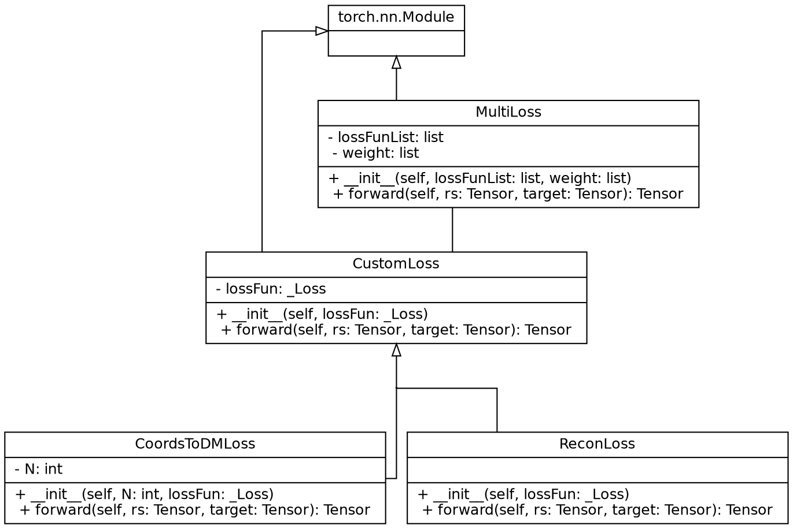

```graphviz

digraph LossFunction {
fontname = "Bitstream Vera Sans"
fontsize = 10
splines=ortho

node [
fontname = "Bitstream Vera Sans"
fontsize = 12
shape = "record"
]

edge [
arrowtail = "empty"
dir= "back"
]

Module [
    label = "{
        torch.nn.Module|
    }"
]

CustomLoss [
    label = "{
        CustomLoss|
        - lossFun: _Loss\l|
        + __init__(self, lossFun: _Loss) \l
        + forward(self, rs: Tensor, target: Tensor): Tensor \l
    }"
]

CoordsToDMLoss [
    label = "{
        CoordsToDMLoss|
        - N: int\l|
        + __init__(self, N: int, lossFun: _Loss)\l
        + forward(self, rs: Tensor, target: Tensor): Tensor \l
    }"
]

ReconLoss [
    label = "{
        ReconLoss||
        + __init__(self, lossFun: _Loss) \l
        + forward(self, rs: Tensor, target: Tensor): Tensor \l
    }"
]

MultiLoss [
    label = "{
        MultiLoss|
        - lossFunList: list\l
        - weight: list\l|
        + __init__(self, lossFunList: list, weight: list)\l
        + forward(self, rs: Tensor, target: Tensor): Tensor \l
    }"
]

sub [shape=point,width=0.01,height=0.01]

sub -> {CoordsToDMLoss, ReconLoss} [dir=none]

Module -> CustomLoss 
CustomLoss -> sub

Module -> MultiLoss

MultiLoss -> CustomLoss [dir=none]


}

```