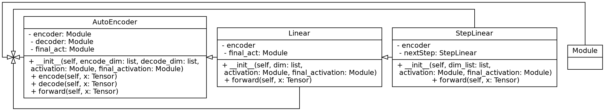

```graphviz

digraph Model {
fontname = "Bitstream Vera Sans"
fontsize = 10
splines=ortho

node [
fontname = "Bitstream Vera Sans"
fontsize = 12
shape = "record"
]

edge [
arrowtail = "empty"
dir= "back"
]


Module [
    label = "{
        Module|
    }"
]

AutoEncoder [
    label = "{
        AutoEncoder|
        - encoder: Module\l
        - decoder: Module\l
        - final_act: Module\l|
        + __init__(self, encode_dim: list, decode_dim: list, \l
        activation: Module, final_activation: Module)\l
        + encode(self, x: Tensor)\l
        + decode(self, x: Tensor)\l
        + forward(self, x: Tensor)\l
    }"
]

Linear [
    label = "{
        Linear|
        - encoder\l
        - final_act: Module\l|
        + __init__(self, dim: list,\l
        activation: Module, final_activation: Module)\l
        + forward(self, x: Tensor)\l
    }"
]

StepLinear [
    label = "{
        StepLinear|
        - encoder\l
        - nextStep: StepLinear\l|
        + __init__(self, dim_list: list,\l
        activation: Module, final_activation: Module)\l
        + forward(self, x: Tensor)
    }"  
]


sub [shape=point,width=0.01,height=0.01]

{rank=same; sub; Module, Linear}
{rank=same; rankdir="TB"; AutoEncoder; Linear, StepLinear}
AutoEncoder -> Linear -> StepLinear 

sub -> AutoEncoder
sub -> Linear
sub -> StepLinear

sub -> Module

}

```
{rankdir="TB"; AutoEncoder; Linear; StepLinear}
