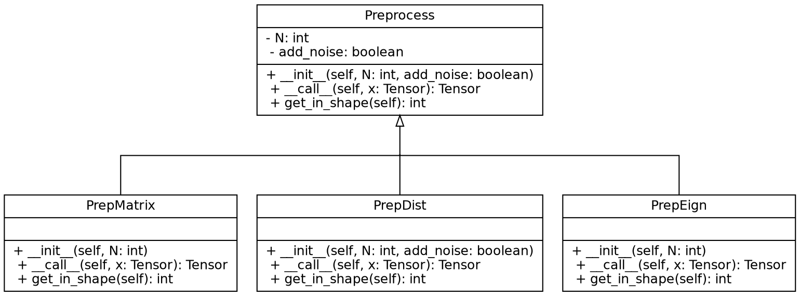

```graphviz

digraph LossFunction {
fontname = "Bitstream Vera Sans"
fontsize = 10
splines=ortho

node [
fontname = "Bitstream Vera Sans"
fontsize = 12
shape = "record"
]

edge [
arrowtail = "empty"
dir= "back"
]


Preprocess [
    label = "{
        Preprocess|
        - N: int\l
        - add_noise: boolean\l|
        + __init__(self, N: int, add_noise:  boolean)\l
        + __call__(self, x: Tensor): Tensor\l
        + get_in_shape(self): int\l
    }"
]


PrepMatrix [
    label = "{
        PrepMatrix||
        + __init__(self, N: int)\l
        + __call__(self, x: Tensor): Tensor\l
        + get_in_shape(self): int\l
    }"
]

PrepDist [
    label = "{
        PrepDist||
        + __init__(self, N: int, add_noise: boolean)\l
        + __call__(self, x: Tensor): Tensor\l
        + get_in_shape(self): int\l
    }"
]

PrepEign [
    label = "{
        PrepEign||
        + __init__(self, N: int)\l
        + __call__(self, x: Tensor): Tensor\l
        + get_in_shape(self): int\l
    }"
]


sub [shape=point,width=0.01,height=0.01]

sub -> {PrepMatrix, PrepDist, PrepEign} [dir=none]
Preprocess -> sub

}

```