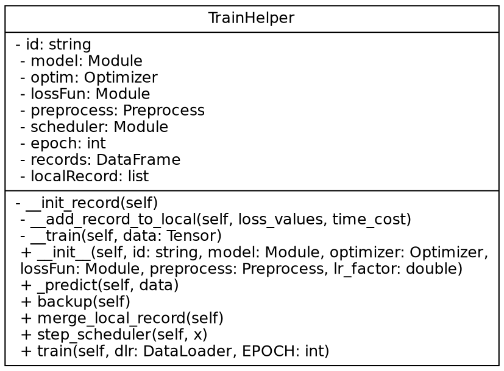

```graphviz

digraph Train {
fontname = "Bitstream Vera Sans"
fontsize = 10
splines=ortho

node [
fontname = "Bitstream Vera Sans"
fontsize = 12
shape = "record"
]

edge [
arrowtail = "empty"
dir= "back"
]

TrainHelper [
    label = "{
        TrainHelper|
        - id: string \l
        - model: Module\l
        - optim: Optimizer\l
        - lossFun: Module\l
        - preprocess: Preprocess\l
        - scheduler: Module\l
        - epoch: int\l
        - records: DataFrame\l
        - localRecord: list\l|
        - __init_record(self)\l
        - __add_record_to_local(self, loss_values, time_cost)\l
        - __train(self, data: Tensor)\l
        + __init__(self, id: string, model: Module, optimizer: Optimizer,\l
        lossFun: Module, preprocess: Preprocess, lr_factor: double)\l
        + _predict(self, data)\l
        + backup(self)\l
        + merge_local_record(self)\l
        + step_scheduler(self, x)\l
        + train(self, dlr: DataLoader, EPOCH: int)\l
    }"
]

TrainHelper

}

```
