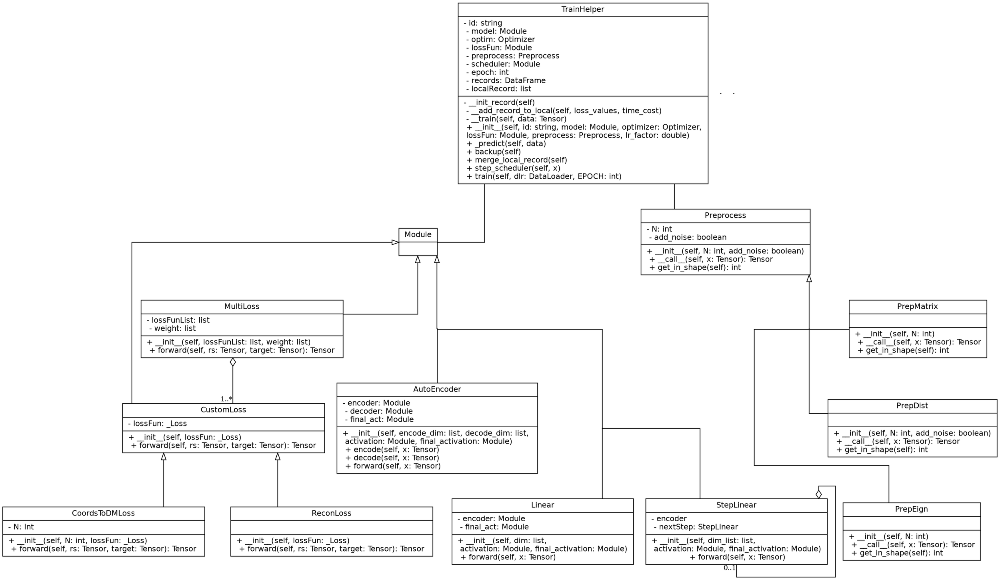

```graphviz

digraph LossFunction {
fontname = "Bitstream Vera Sans"
fontsize = 8
splines=ortho

node [
fontname = "Bitstream Vera Sans"
fontsize = 11
shape = "record"
]

edge [
arrowtail = "empty"
dir= "back"
fontsize = 10
]

Module [
    label = "{
        Module|
    }"
]

CustomLoss [
    label = "{
        CustomLoss|
        - lossFun: _Loss\l|
        + __init__(self, lossFun: _Loss) \l
        + forward(self, rs: Tensor, target: Tensor): Tensor \l
    }"
]

CoordsToDMLoss [
    label = "{
        CoordsToDMLoss|
        - N: int\l|
        + __init__(self, N: int, lossFun: _Loss)\l
        + forward(self, rs: Tensor, target: Tensor): Tensor \l
    }"
]

ReconLoss [
    label = "{
        ReconLoss||
        + __init__(self, lossFun: _Loss) \l
        + forward(self, rs: Tensor, target: Tensor): Tensor \l
    }"
]

MultiLoss [
    label = "{
        MultiLoss|
        - lossFunList: list\l
        - weight: list\l|
        + __init__(self, lossFunList: list, weight: list)\l
        + forward(self, rs: Tensor, target: Tensor): Tensor \l
    }"
]

Preprocess [
    label = "{
        Preprocess|
        - N: int\l
        - add_noise: boolean\l|
        + __init__(self, N: int, add_noise:  boolean)\l
        + __call__(self, x: Tensor): Tensor\l
        + get_in_shape(self): int\l
    }"
]


PrepMatrix [
    label = "{
        PrepMatrix||
        + __init__(self, N: int)\l
        + __call__(self, x: Tensor): Tensor\l
        + get_in_shape(self): int\l
    }"
]

PrepDist [
    label = "{
        PrepDist||
        + __init__(self, N: int, add_noise: boolean)\l
        + __call__(self, x: Tensor): Tensor\l
        + get_in_shape(self): int\l
    }"
]

PrepEign [
    label = "{
        PrepEign||
        + __init__(self, N: int)\l
        + __call__(self, x: Tensor): Tensor\l
        + get_in_shape(self): int\l
    }"
]

AutoEncoder [
    label = "{
        AutoEncoder|
        - encoder: Module\l
        - decoder: Module\l
        - final_act: Module\l|
        + __init__(self, encode_dim: list, decode_dim: list, \l
        activation: Module, final_activation: Module)\l
        + encode(self, x: Tensor)\l
        + decode(self, x: Tensor)\l
        + forward(self, x: Tensor)\l
    }"
]

Linear [
    label = "{
        Linear|
        - encoder: Module\l
        - final_act: Module\l|
        + __init__(self, dim: list,\l
        activation: Module, final_activation: Module)\l
        + forward(self, x: Tensor)\l
    }"
]

StepLinear [
    label = "{
        StepLinear|
        - encoder\l
        - nextStep: StepLinear\l|
        + __init__(self, dim_list: list,\l
        activation: Module, final_activation: Module)\l
        + forward(self, x: Tensor)
    }"  
]

TrainHelper [
    label = "{
        TrainHelper|
        - id: string \l
        - model: Module\l
        - optim: Optimizer\l
        - lossFun: Module\l
        - preprocess: Preprocess\l
        - scheduler: Module\l
        - epoch: int\l
        - records: DataFrame\l
        - localRecord: list\l|
        - __init_record(self)\l
        - __add_record_to_local(self, loss_values, time_cost)\l
        - __train(self, data: Tensor)\l
        + __init__(self, id: string, model: Module, optimizer: Optimizer,\l
        lossFun: Module, preprocess: Preprocess, lr_factor: double)\l
        + _predict(self, data)\l
        + backup(self)\l
        + merge_local_record(self)\l
        + step_scheduler(self, x)\l
        + train(self, dlr: DataLoader, EPOCH: int)\l
    }"
]

PrepMatrix -> PrepDist -> PrepEign [style=invis]
subprep [shape=point,width=0.01,height=0.01]

{rank="same"; subprep; PrepMatrix}

subprep -> {PrepMatrix, PrepDist, PrepEign} [dir=none]

Preprocess -> subprep

subModel1 [shape=point,width=0.01,height=0.01]
subModel2 [shape=point,width=0.01,height=0.01]
subModel3 [shape=point,width=0.01,height=0.01]
subModel4 [shape=point,width=0.01,height=0.01]

subModel1 -> {Linear, StepLinear} [dir=none]
subModel2 -> {subModel1, AutoEncoder} [dir=none]
Module -> subModel2

StepLinear -> StepLinear:sw [headlabel="0..1" arrowtail="odiamond"]

Module -> CustomLoss -> {CoordsToDMLoss, ReconLoss}
Module -> MultiLoss
MultiLoss -> CustomLoss [headlabel="1..*" arrowtail="odiamond"]

TrainHelper -> Preprocess [dir=none]
TrainHelper -> Module [dir=none]

TrainHelper -> {StepLinear, Linear} [style=invis]
TrainHelper -> {CoordsToDMLoss, ReconLoss} [style=invis]
TrainHelper -> {PrepDist} [style=invis]


}

```

Module -> {Linear, StepLinear, AutoEncoder} [dir=none]

subModel3 -> {Linear, StepLinear} [dir=none]
subModel4 -> {subModel3, AutoEncoder} [dir=none]
Module -> subModel4 [dir=none]